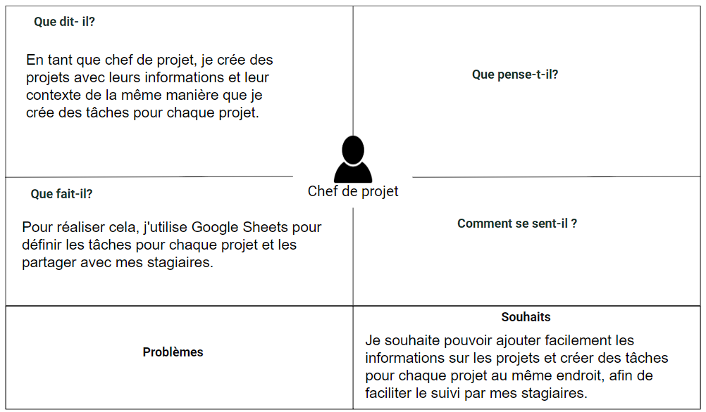
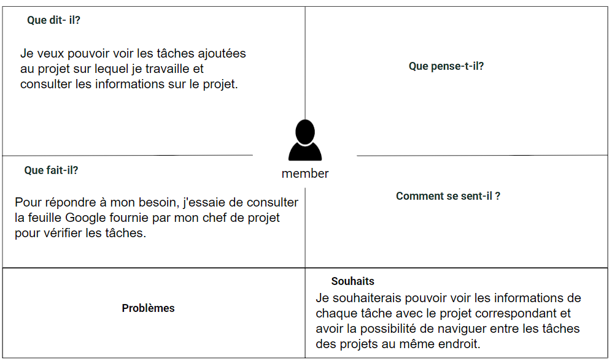
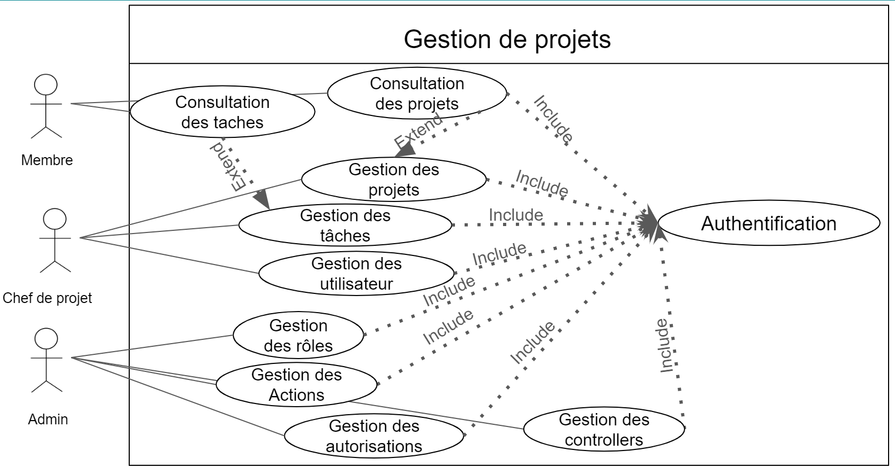

# Besion
{:class="sectionHeader"}

<!-- new slide -->

## Empathie chef de projet
 
{:width="1000px"}

<!-- note -->

## Chef de projet

Le chef de projet occupe une place essentielle dans le processus de réalisation des projets. Dans cette section, nous explorerons en détail sa méthode de gestion pour mener à bien ces projets.

### Empathie : Chef de projet

Une séance d’empathie a été réalisée avec Abdelatif Soklabi, un formateur web en solicode

- **Ce qu’il dit :**

  - Créer des projets avec leurs informations et leur contexte.
  - Créer des tâches pour chaque projet de la même manière

- **Souhaits :**

  - Ajouter facilement les informations sur les projets.
  - Créer des tâches pour chaque projet au même endroit.
  - Faciliter le suivi par mes stagiaires.

- **Ce qu’il fait :**

  - Utiliser Google Sheets pour définir les tâches pour chaque projet.
  - Partager les tâches avec mes stagiaires.

<!-- new slide -->

## Empathie de membre

{:width="1000px"}
_figure: empathy de membre_

<!-- note -->

Chaque membre dans chaque projet joue un rôle essentiel dans la réalisation du projet en complétant les tâches. Voici un processus pour y parvenir avec la contribution de certains membres.

### Empathie : membre

Une séance d’empathie a été réalisée avec les apprenants de formateur abdelatif soklabi

- **Ce qu’il dit :**

  - Visualiser les tâches ajoutées au projet en cours.
  - Consulter les détails du projet.
  - Accéder aux informations relatives au projet.
  - Obtenir une vue d'ensemble des tâches et des détails du projet.

- **Souhaits :**

  - Consulter les détails de chaque tâche avec son projet associé.
  - Faciliter la navigation entre les tâches des différents projets.
  - Accéder à toutes les informations nécessaires au même endroit.
  - Avoir une vue d'ensemble des tâches et des projets pour une meilleure gestion.

- **Ce qu’il fait :**

  - Consulter la feuille Google fournie par mon chef de projet.
  - Vérifier les tâches nécessaires.

<!-- new slide -->

## Définir le problème

{:width="700px"}
*figure: définir le problème*

<!-- note -->
Perdre énormément de temps à consulter les tâches et à naviguer entre celles-ci dans différents projets en raison de la lenteur du téléchargement des données, en raison d'un volume important de données.

<!-- new slide -->

## Idéation

{:width="1000px"}
*figure: ideation*

<!-- note -->

Conception et développement d'une application de gestion de projets, de tâches et de membres.

<!-- new slide -->

# Analyse

## Diagramme de cas d'utilisation

{:width="1000px"}
*figure: cas d'utilisation*

<!-- new slide -->